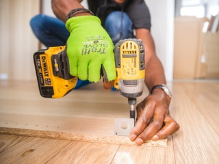
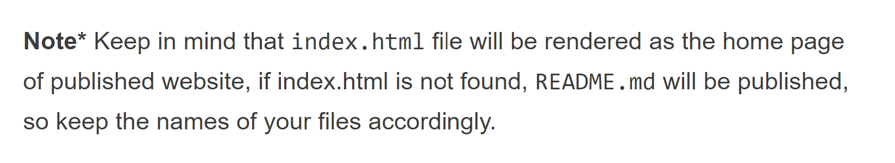
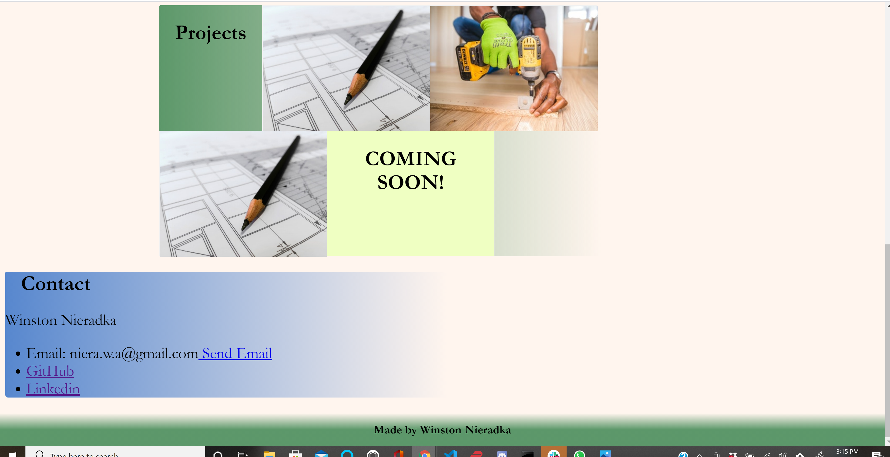
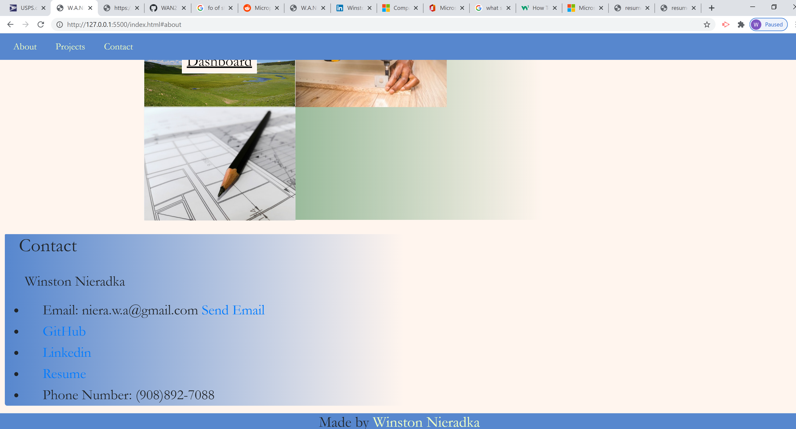

# portfolio_website
Created  html and css for a portfolio webpage.
Css was aided by W3schools [W3schools](https://www.w3schools.com/default.asp)
Over all the project was challenging but fun and will be on going.

## Overveiw:

* header made with the aid of [W3schools](https://www.w3schools.com/howto/howto_css_hero_image.asp) for the hero image
* links in nav bar were made with the aid of [stack overflow](https://stackoverflow.com/questions/47960948/link-grow-font-on-hover) to grow links for visability
* had to run with trial and error with the linear-gradient when root colors would not work and discovered that rgb was appropriate
* had a problem with the page opening at 50% zoom in chrome John the instructor pointed that out to me. I also used the aid of [stackoverflow](https://stackoverflow.com/questions/712689/css-div-stretch-100-page-height) to change the zoom when the page is opened
* the image flip with in projects was seen before and wanted it for more flair it was implemented with the aid of [W3scools](https://www.w3schools.com/howto/howto_css_flip_image.asp)
* styling images were both provided by [pexels](https://www.pexels.com/)

* after strugling with publishing my site I felt it was be to make a new repo (which was wrong!). I should of reserched more. when I did I found my problem was 
I misspelled index (idex) I realized this when I walked though the steps of publishing here [publishing steps](https://hackernoon.com/use-custom-domain-with-github-pages-2-straightforward-steps-cf561eee244f) 

 
### Screenshots

[site link](https://wan2748.github.io/portfolio_website/) 

#### Update 4/5/2021
* Fixed navbar placed at top of page and made sticky for scrolling 
* added projects to showcase skills
* added about me section
* added updated resume with download link
* added bootstrap and font awesome and bootstrap for styling

##### Screenshots

[site link](https://wan2748.github.io/portfolio_website/) 